**Crypto World Summit**

## Hunting the Bear:

# Yield Farming for Fun and Profit

**John Nguyen**
_Ninja Software CTO_
_Unqualified Bear Hunter_
"_I just like the tech_"

---

# Who am I?

- John Nguyen
- Mining engineer (Piping, Mechanical, Process Controls, Industrial Networks)
- 15 years programming experience
- Ninja Software CTO and Co-founder

---

# Who am I in crypto?

- 9 years in crypto (since 2013)
- Ghana deployment
  - Bought BTC for $100
  - Bartered goods for BTC
  - Developed algorithmic trading bots on Mt Gox
    - Lost a lot of money!

---

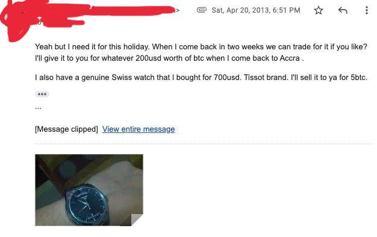

---

# Who am I in crypto (cont.)?

- Crypto-steel and cold storage
- Entered hibernation after blocksize wars
- Developed blockchain forensics and applications
- Advise on private funds (PBS investments and others)
- Member of Perth Cypherpunk Council

---

# Today's talk

- Yield farming via liquidity provisioning
- Using Uniswap V3, the most cutting edge AMM
- Covering:T
  - Position discovery
  - Range types
  - Position maintenance

---

# Why bother?

- Extremely high yields
- React to changing market conditions
- Less competition from other yield farmers

---

# Pre-requisites

- This is an _intermediate_ talk
  - Understand how to use MetaMask and other wallets
  - Self custody of crypto
  - Gas fee management

---

# A super fast primer into DeFi

## Hold on to your hats!

---

# What is the blockchain?

- Decentralised triple entry ledger
  - Reversed linked list structure of blocks, each containing:
    - Block header containing metadata and a hash pointer to the previous block
    - Cryptographically verified transactions, each containing:
      - Simple value transfer (Bitcoin UTXO); or
      - More complex smart contract invocation (Ethereum)

Blockchain security is backed by consensus mechanisms (Proof of Work, Proof of Stake), secured by incentivised miners or stakers.

---

# What are smart contracts?

- Programmable value!
- NOT a legal contract or agreement
- Functions that are deployed to the blockchain that interact with other deployed contracts or wallet addresses
- Programs that execute logic and deal with the transfer of value

---

# What is Decentralised Finance (DeFi)?

- Fastest growing sector within blockchain technology
- Trustless financial tools
- Protocols instead of companies
- Shared state instead of silo-ed data
- Lend, borrow, trade, insure, do all sorts of things!

## No middlemen, no vetting, no blockers

---

# What is Yield Farming?

- The art and science of combining the money legos of DeFi to maximise yield
- Tokenised _everything_
  - Lending tokens
  - Borrowing tokens
  - Derivative tokens
- We can use these tokens and interoperate with different DeFi protocols in weird and wonderful ways

---

# What is an Automated Market Maker (AMM)?

- Liquidity pool for swaps
- Two main parties:
  - Traders swaps between pairs
  - Liquidity providers can provide liquidity, receive fees and token rewards
- One of the blocks (money legos) for yield farming
- A few examples: Bancor, Balancer, Sushi, Uniswap V2/V3

---

# What is an AMM (cont.)?

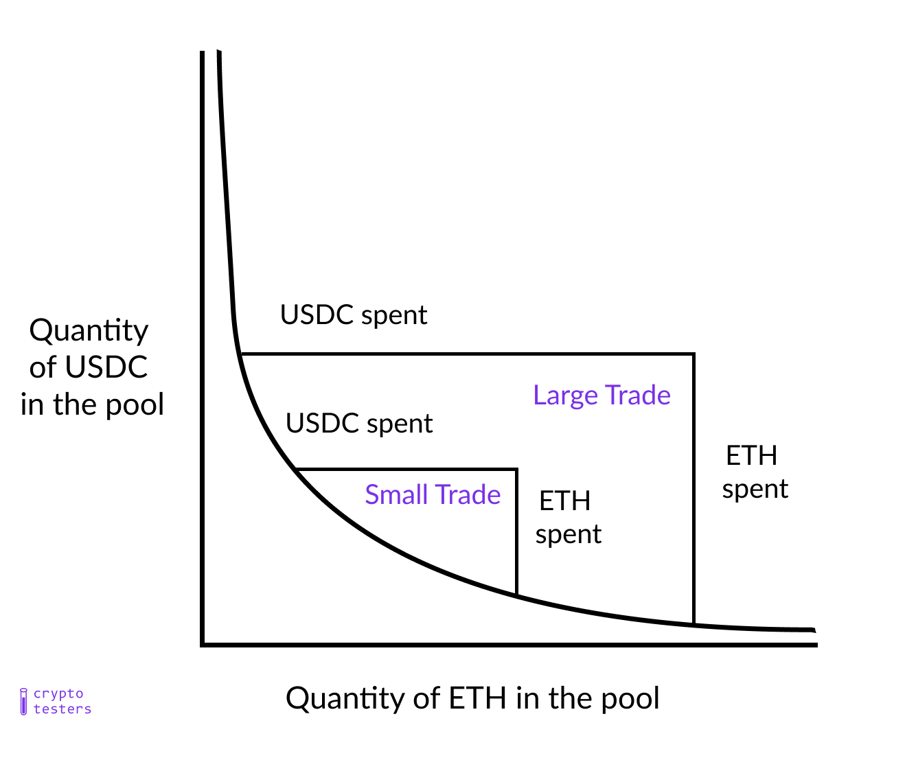

---

# What is Uniswap V3?

- One of the most popular AMMs
- New version of Uniswap
- Highly capital efficient
- Liquidity providers create positions with a min and max value
- Can function as limit orders, avoiding slippage

---

# What is a position?


- A limit order that executes over a price range
- You provide liquidity on a pair (e.g. ETH/USDC) for other users to swap against

---

# What is a position (cont.)?

- While the market price is within your range:
  - Fees are generated (0.3%)
  - Your liquidity slowly shifts from one to the other
- While the market price is outside your range:
  - No fees are generated
  - Your liquidity is one-sided (100% ETH or 100% USDC)

---

# How do I choose a position?

- Step 1: Select pair
- Step 2: Select position type
- Step 3: Select position range
- Step 4: Deploy your position
- Step 5: Maintain the position

---

# Step 1: Select Pair on Dune Analytics

An Ethereum analytics platform that is community driven.

---

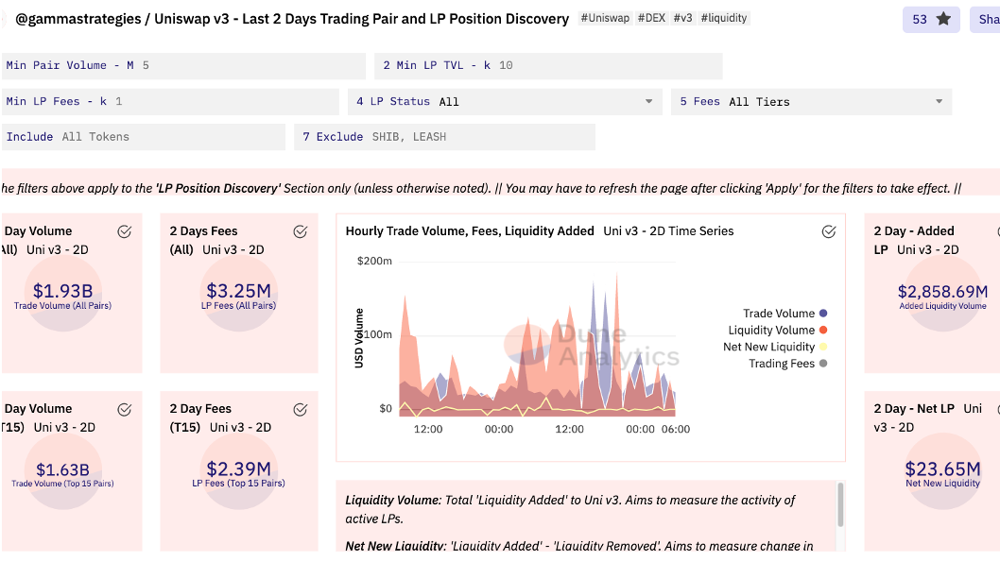

---

# Step 1 (cont.): Select Pair on dune

Aim for high volume, high fees/TVL, high #trades and solid project fundamentals.

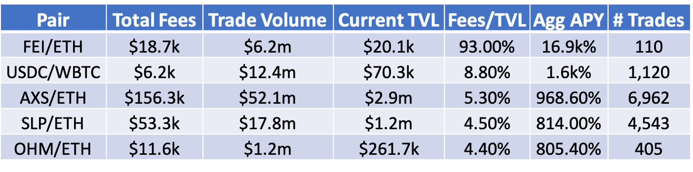

---

# Step 2: Select position type (Over, Under, In-Range)

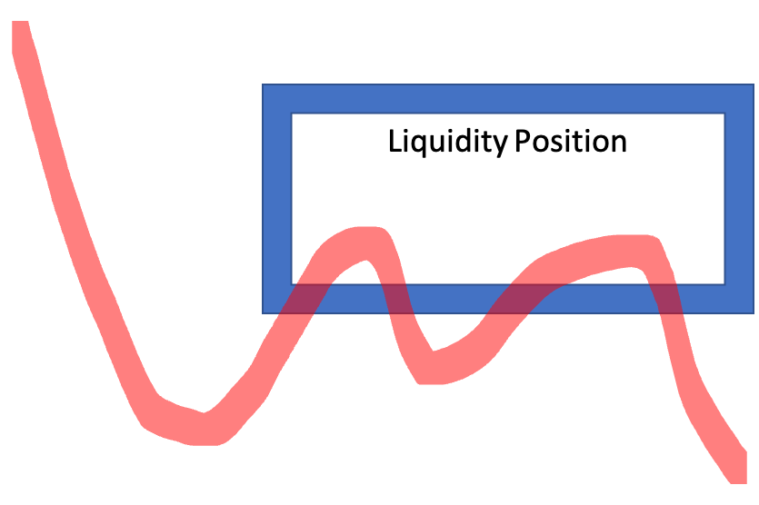
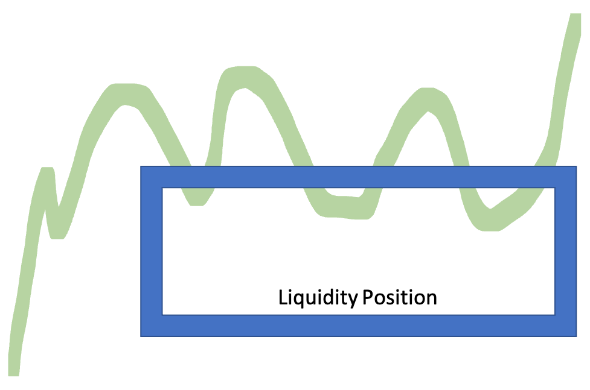
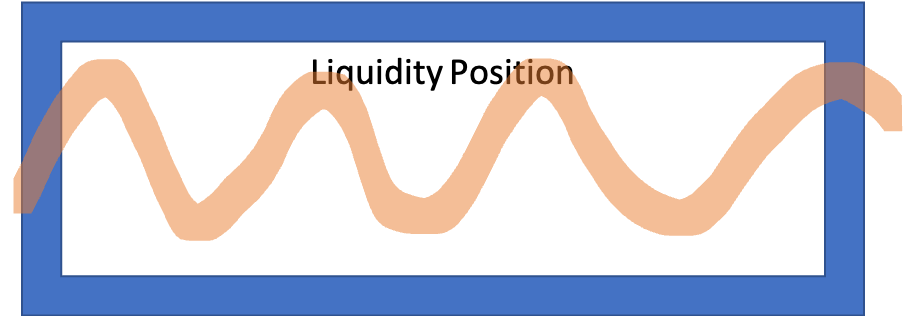

---

## Position Type: Over

Good for bear market.

- Capture increases in price
- Low risk fee accrual

---

# Position Type: Under

Good for bull market.

- Capture dips in price
- Low risk fee accrual

---

# Position Type: Within Range

Good for sideways market.

- Capture fees from volatility
- Automatic rebalancing
  - "Sell" on the way up
  - "Buy" on the way down
- Medium risk fee accrual (breakout risk)

---

# Advanced Position Types (Daytrade)

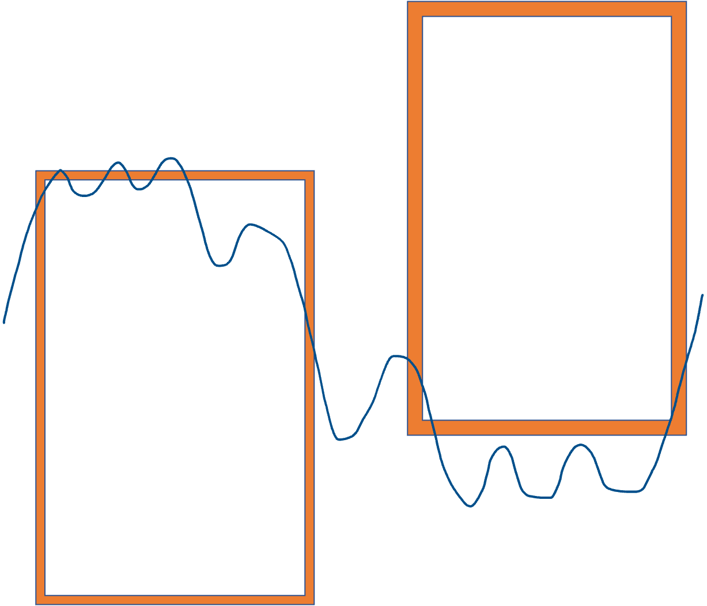

- Time the market: Not recommended!
  - Close positions when the price crosses over
  - Open new position on the other side
  - Farm volatility for capital gains

---

# Step 3: Select position range with a min and max price

- This depends on price volatility
- High volatility requires larger ranges
  - Greater exposure to price increases
  - Reduced fees
- Low volatility requires smaller ranges
  - Greater exposure to price increases
  - Increased fees

---

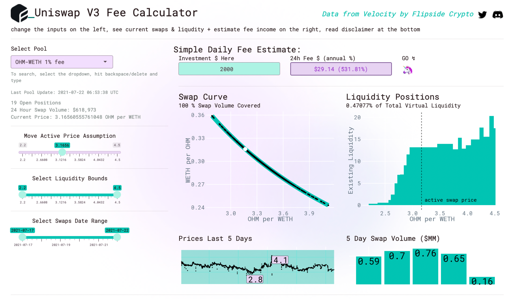

---

# Step 3 (cont.): Select position range

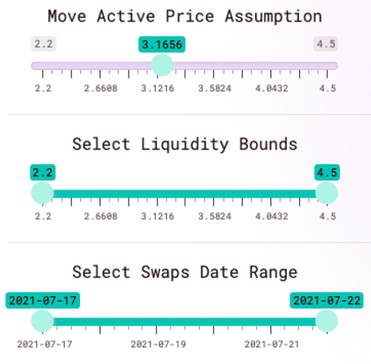

Set your inputs

- Price Assumption
- Min max price
- Swap volume date range

---

# Step 3 (cont.): Select position range

Enter investment amount

- ~$30 per day of fees will be generated with the current settings

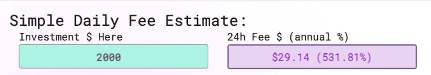

---

# Step 3 (cont.): Select position range

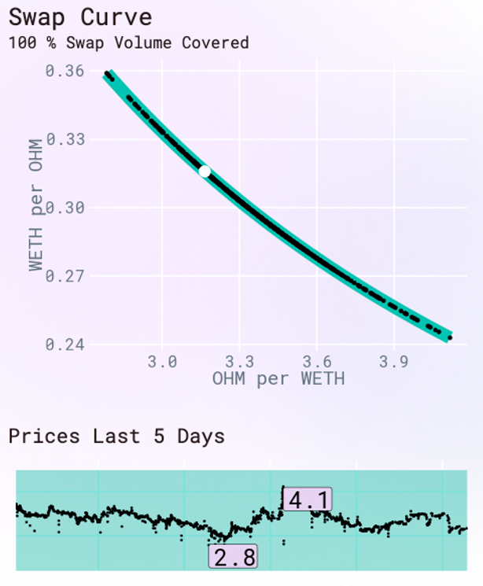

Review the swap charts

- 100% of volume covered
- Lookin' good!

---

# Step 3 (cont.): Select position range

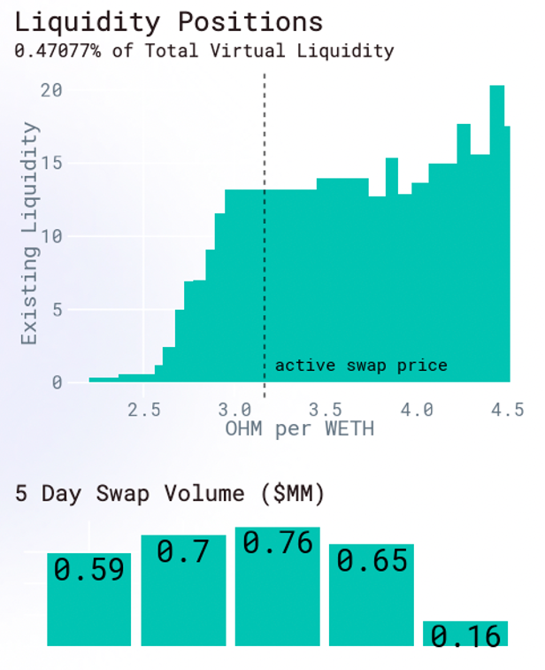

Review liquidity charts

- 0.4% of virtual liquidity (not too diluted or concentrated)
- Reasonable volume (~$600,000 per day)

---

# Step 3 (cont.): Select position range

Play with the values in Flipside crypto to optimise your risk/reward.

## Position summary:

- Range: 2.2OHM to 4.2OHM
- Volatility: 100% of 5 day price captured
- Fees: 29USD fees generated per day for 2000USD investment

---

# Step 4: Deploy your position

Now it is time to deploy to Uniswap V3!

Make sure you have enough ETH in your wallet to pay the gas fees.

You may need to purchase one or the other token in the pair to be able to fund the position.

---

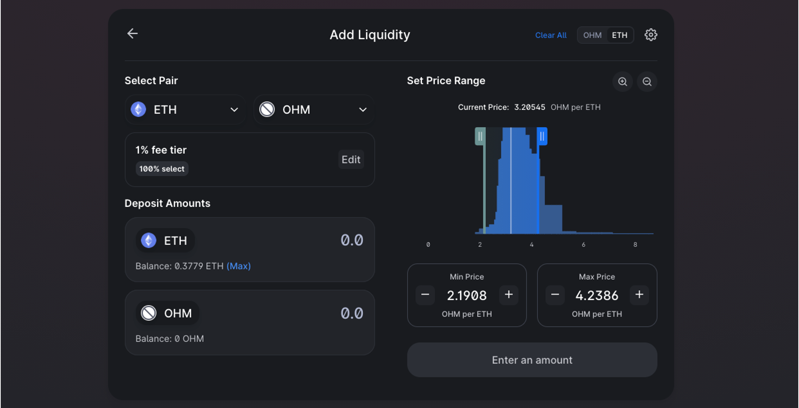

---

# Step 5: Maintain the position

- Claim fees and compound
- Exit and redeploy after crossing over
- Exit and redeploy to chase the price
- Collected about 250USD over a week

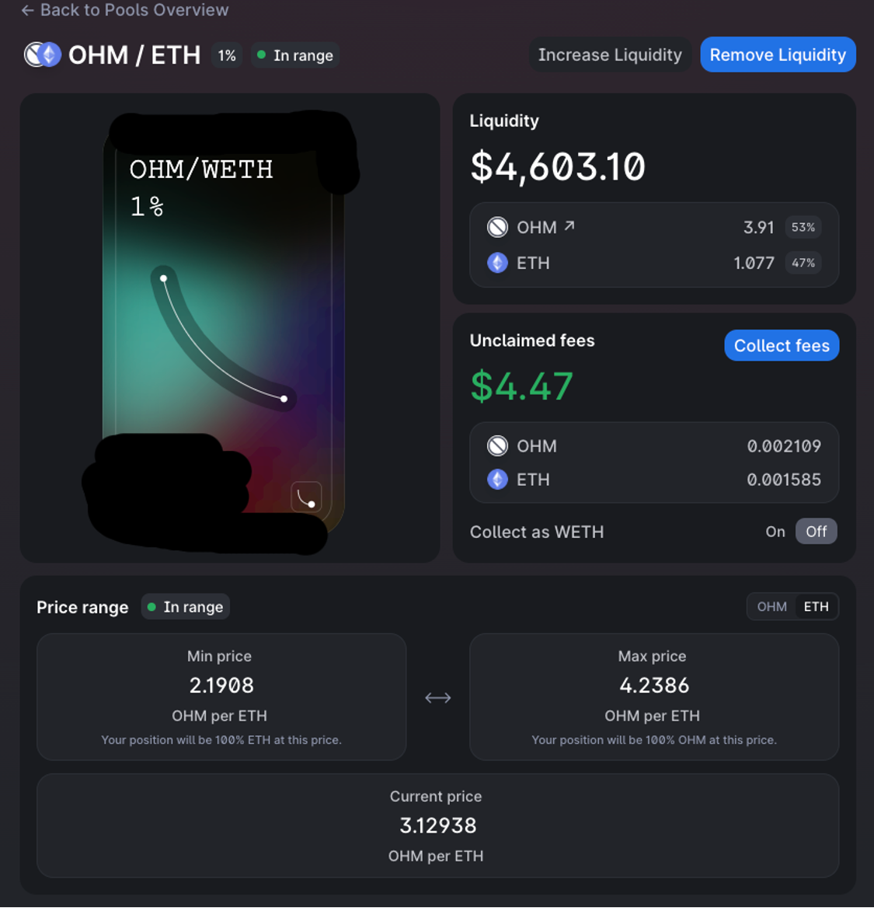

---

# Risk 1 - Impermanent Loss

Price moves from one side of a position to the other, it is the equivalent of executing a limit order
Impermanent loss is only realized if you exit your position

- It will always be on the “wrong side”
  - If OHM goes to the moon, you will have 100% ETH
  - If ETH goes to the moon, you will have 100% OHM

Mitigation 1: Long both tokens so you’ll be happy either way
Mitigation 2: “Chase” price (take profit/stop loss) by closing and opening new positions

---

# Risk 2 - Volatile Market

- DeFi tokens are extremely volatile
- Reported APY is always changing
- Market can move the wrong way, requiring repositioning
- Gas fees will eat at your profits until roll-ups become more common

---

# Risk Mitigation

Verify that a project has satisfied the 5 fundamentals of a good DeFi system

- Community
- Tokenomics
- Leadership
- Security
- Open source

Come and see me if you want to learn more about DeFi due diligence.

---

# What next?

We've barely scratched the surface of yield farming!

- Liquidity provision into traditional AMMs (Balancer)
- Hunt for airdrops (UNI)
- Save gas with rollups (Optimism)
- Bond and stake LP tokens for additional rewards (Gysr)
- Leverage with Compound Finance and IndexCoop (ETH2X-FLI)
- Invest in indexed tokens (DPI, BED)
- Increase yield with recursive borrowing (Compound)

---

# What next (cont.)?

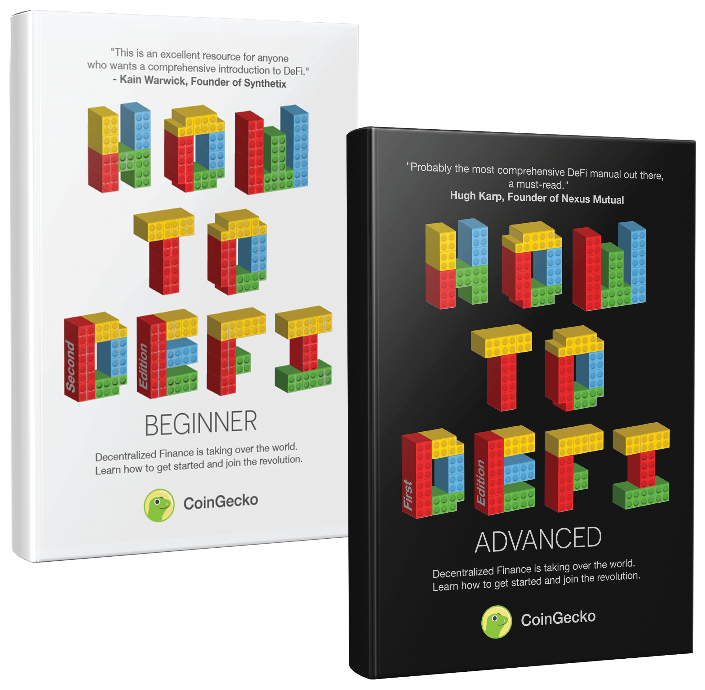

- Read some books (CoinGecko)
- Single sided staking (OHM)
- Buy some NFTs (OpenSea)
- Look into fixed income protocols (Pendle)
- Buy insurance (Nexus)
- Program your own smart contracts (Solidity)!

---

# Contact me

Happy to chat over a coffee about anything to do with crypto, NFTs, software engineering and app development.

- Email: john@ninjasoftware.com.au
- Twitter: @nii236

---

# ...and Finally

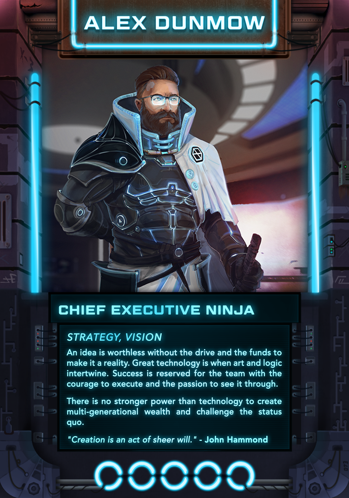
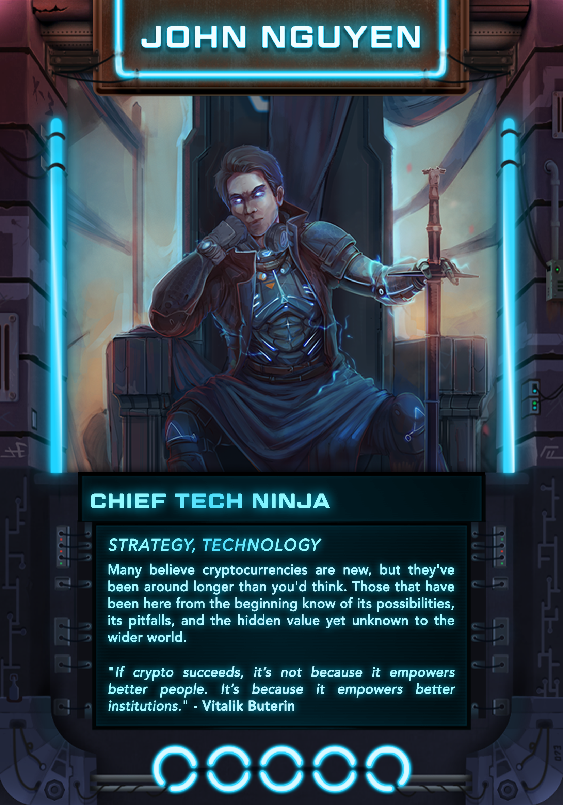

_Come get a limited edition NFT!_
